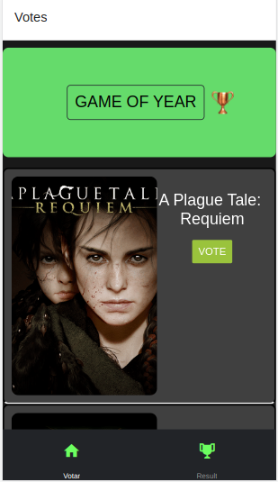
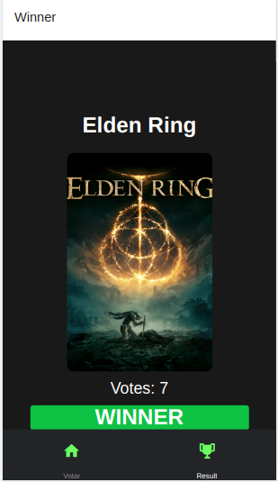

<h1 align="center"> Game Awards </h1>

  <a href="#-tecnologias">Technologies</a>&nbsp;&nbsp;&nbsp;|&nbsp;&nbsp;&nbsp;
  <a href="#-projeto">Project</a>&nbsp;&nbsp;&nbsp;|&nbsp;&nbsp;&nbsp;
  <a href="#memo-licença">License</a>

  

 

  
  

## 🚀 Technologies

This project was developed with the following technologies:

- React Native

## 📍 Bibliotecas utilizadas

- Expo (https://docs.expo.dev/)
- React Navigation(https://reactnavigation.org/docs/getting-started/)

## 💻 Projeto

This project simulates voting for the Game Awards.

## :memo: Licença

This project is licensed by MIT.

---
